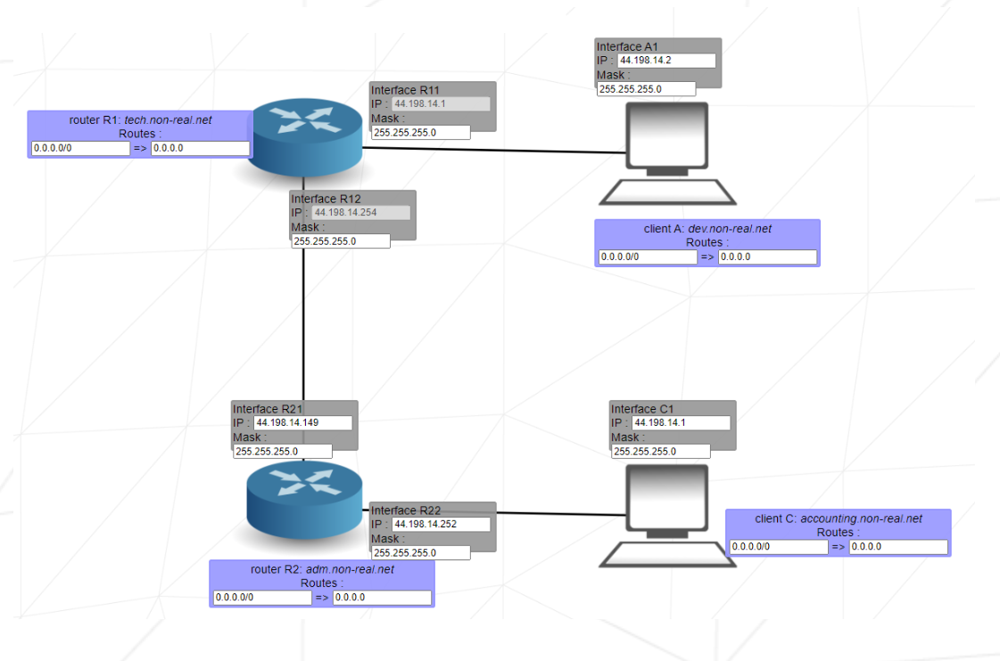

# Net Practice

  

  

## What is it?
A 42 practical exercise to configure small-scale networks with TCP/IP addressing.

## How it worked
Basically, you needed to solve networking problems to make a network run.  
There was a web program designed like a game with 10 levels, each with a non-functioning network diagram.  
Each level had goals to achieve and issues to solve to make the network run properly.  
During the defense of the project, you needed to succeed in solving three random levels in 10 minutes.  

**Succeeded with 100%**

## Skills
- Network & system administration
- Rigor 

## License
This project is licensed under the DO WHAT THE FUCK YOU WANT TO PUBLIC LICENSE - see the [LICENSE](https://github.com/hde-oliv/net_practice/blob/master/LICENSE) file for details.
